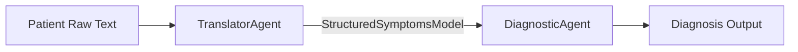

# 13. Pydantic with LangChain & LangGraph

In modern **agentic systems**, agents need to talk to each other in predictable, machine-readable ways. Free-form text can lead to errors, while structured objects (validated against schemas) ensure reliability.

This is where **Pydantic** becomes invaluable when integrated with **LangChain** and **LangGraph**:

* In **LangChain**, Pydantic defines structured inputs/outputs for prompt templates and LLM responses.
* In **LangGraph**, Pydantic acts as the contract layer for message passing between nodes (agents).

---

## 13.1 Why Use Pydantic in LangChain Workflows?

* **Consistent schemas** → Ensure all agents pass/receive the same data structure.
* **Automatic validation** → Catch bad data early (e.g., missing patient age).
* **Typed prompts/outputs** → Convert raw text from LLMs into structured objects.

---

## 13.2 Defining a Structured Model

Suppose we want a **TranslatorAgent** to convert raw patient input into structured symptoms.

```python
from pydantic import BaseModel
from typing import List

class StructuredSymptomsModel(BaseModel):
    patient_id: str
    age: int
    symptoms: List[str]
    duration_days: int
```

This model ensures any output includes a valid patient ID, age, symptoms list, and duration.

---

## 13.3 Using Pydantic with LangChain

LangChain provides **`PydanticOutputParser`** to directly parse LLM responses into Pydantic models.

```python
from langchain.output_parsers import PydanticOutputParser
from langchain.prompts import PromptTemplate

parser = PydanticOutputParser(pydantic_object=StructuredSymptomsModel)

prompt = PromptTemplate(
    template="Extract structured medical details:\n\n{raw_text}\n\n{format_instructions}",
    input_variables=["raw_text"],
    partial_variables={"format_instructions": parser.get_format_instructions()},
)

raw_text = "I have been coughing for 3 days and feeling feverish. My ID is P1234, age 45."
```

When this prompt is executed with an LLM, the parser ensures structured output.

---

## 13.4 Pydantic with LangGraph Nodes

In **LangGraph**, each node (agent) can declare **input and output models**.

Example:

* `TranslatorAgent` → outputs `StructuredSymptomsModel`
* `DiagnosticAgent` → takes `StructuredSymptomsModel` as input

```python
from langgraph.graph import StateGraph

def translator_agent(state):
    # Converts raw text into structured model
    return StructuredSymptomsModel(
        patient_id="P1234",
        age=45,
        symptoms=["cough", "fever"],
        duration_days=3
    )

def diagnostic_agent(state: StructuredSymptomsModel):
    # Use structured data for decision
    if "fever" in state.symptoms:
        return {"diagnosis": "Possible infection, recommend further tests"}
    return {"diagnosis": "Monitor symptoms"}
```

This guarantees **type-safe communication** between agents, avoiding misinterpretations.

---

## 13.5 Example Workflow

**Flow**:

1. Patient speaks in natural language.
2. `TranslatorAgent` converts text → `StructuredSymptomsModel`.
3. `DiagnosticAgent` receives structured model and produces diagnosis.



---

## 13.6 Key Takeaways

* **LangChain** → Use Pydantic to enforce structured LLM outputs.
* **LangGraph** → Use Pydantic as schema contracts between agents.
* **Agent reliability** comes from typed validation, making workflows safer in sensitive domains like healthcare.

---

✅ **Example Recap**:

* Input: `"I have been coughing for 3 days and feeling feverish. My ID is P1234, age 45."`
* TranslatorAgent → outputs

  ```json
  {
    "patient_id": "P1234",
    "age": 45,
    "symptoms": ["cough", "fever"],
    "duration_days": 3
  }
  ```
* DiagnosticAgent → uses structured input to recommend next steps.

---
